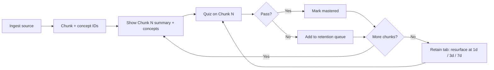

# Experiment: AI Learn & Retain Coach — v1

**Date:** June 23, 2026
**Week:** 5 (first deploy) · prototype Week 5 · spec in Week 4
**Version:** v1
**Model:** Claude Sonnet 4.6
**Repo (target):** `ai-learn-retain-coach`
**Stack:** Streamlit + Claude API · session state + local JSON for retention tracking · **Deploy:** Streamlit Cloud (Week 5)
**Status:** Spec ready · build Week 5–6 · deploy + feedback Week 6

---

## What it does

User uploads or pastes source material (document, image, or video transcript). The app runs a four-step loop:

1. **Ingest:** parse source into numbered chunks with concept IDs
2. **Learn + Test (per chunk):** for each chunk in sequence, show the summary and key concepts, then immediately quiz the learner on that chunk before advancing to the next. The learner never sees chunk N+1 until they complete the quiz for chunk N.
3. **Retain:** track failed concepts; resurface them on a simple schedule (1 day / 3 days / 7 days)

This productizes the AI tutor workflow already used in this plan: read → quiz → revisit weak areas until retained.

---

## Problem

Most AI study tools stop at explain or chat. They do not close the loop on **retention**. Users feel like they learned something, then fail to recall it days later. NotebookLM and ChatGPT can Q&A over a document. They do not track what you missed, resurface it on a schedule, or score answers against a falsifiable rubric.

---

## User

Primary (v1): you — dogfooding Week 1 to 6 learnings before Interview Coach launch.

Secondary (if deployed): students and professionals who need to master a specific document, slide deck, or transcript, not generic trivia.

---

## Success metrics (mini project)

| Metric | Target (v1) | Why |
|---|---|---|
| Chunk faithfulness | 100% of chunk summaries traceable to source text | Grounding guardrail |
| Quiz rubric agreement | You agree with pass/fail on ≥8/10 manual spot checks | Judge calibration |
| Retention resurfacing | Failed concepts reappear on schedule without manual tracking | Core product value |
| Personal dogfood | Complete one full loop on `week-03.md` before Week 8 | Proves the loop works |

---

## v1 scope

**In scope**
- Pasted plain text
- Uploaded PDF (extract text via Streamlit file upload + pypdf or pdfplumber)
- Uploaded image (Claude vision: describe + extract teachable content)
- Pasted video transcript (user provides transcript; no video parsing)
- Public URL (fetch page text via `requests` + `BeautifulSoup`; strip nav/footer boilerplate; pass cleaned text to chunker; fail gracefully if URL requires login or returns non-200)
- 3 to 7 chunks per source (by token/section heuristics)
- 5 questions per chunk in Test mode
- Binary pass/fail scoring with cited feedback
- Retention queue: concepts marked fail → resurface at +1d, +3d, +7d (session date or local JSON file)

**Out of scope (v1)**
- Video/audio upload and transcription
- User accounts or cloud persistence
- SM-2 or adaptive scheduling algorithms
- Multi-document libraries
- Hindi/regional language (English only in v1)
- Public launch or monetization

---

## Optional Week 4 prototype (1 hour)

If you want to validate eval design early, build **text-only, Test mode only**:

- Input: paste text
- Output: 5 questions + rubric-scored answers
- Skip: PDF, image, retention schedule, chunk UI

Same judge prompt as v1. Proves rubric before Week 6 full build.

---

## Product flow



---

## Streamlit UI (v1)

Two tabs: Source and Retain. The Learn + Test loop runs inline between them as a sequential single-screen flow.

| Step | UI | Output |
|---|---|---|
| 1. Source | Text area + file upload (PDF, image) + transcript paste + URL text input; "Generate chunks" button; source type auto-detected from which field is filled | Raw source + chunks stored in session |
| 2. Learn + Test loop | Chunk card (title, summary, concept list) for chunk N; quiz form for chunk N below the card; progress bar showing chunk N of total; "Score" button; "Next chunk" button unlocks only after quiz is submitted | Pass/fail + feedback + source citation; chunk N+1 hidden until current quiz is submitted |
| 3. Retain | List of due concepts today | Short recap question per due concept |

State rule: `session_state["current_chunk_index"]` advances only after the quiz for the current chunk is submitted. Summary and quiz share the same screen; learner cannot skip ahead.

Persistent state: `retention.json` in repo root (gitignored) for retention queue; `traces.jsonl` (gitignored) for LLM trace logs. Streamlit `session_state` for in-progress UI state only.

### Trace logging (Level 2 prep, Week 3)

Hamel: remove all friction from looking at data. v1 uses a **local JSONL file** (one JSON object per line, appended after each LLM step) — no LangSmith until peer deploy in Week 5.

Log after every chunker, question-writer, and judge call:

```json
{
  "timestamp": "2026-06-23T10:00:00Z",
  "source_id": "week-03-md",
  "step": "chunker | question_writer | judge",
  "input_preview": "first 200 chars of input",
  "output": {},
  "assertions_passed": true,
  "failure_reason": null,
  "synthetic": true
}
```

File: `traces.jsonl` in repo root, gitignored. Review traces when an ingest assertion fails or you disagree with a judge verdict.

---

## Data model

```json
{
  "source_id": "week-03-md",
  "concepts": [
    {
      "concept_id": "C1",
      "chunk_index": 1,
      "label": "Layered measurement stack",
      "source_excerpt": "...",
      "status": "learning | mastered | due",
      "fail_count": 0,
      "next_review": "2026-06-24"
    }
  ]
}
```

Retention rules (v1, simple):
- First fail → review in 1 day
- Second fail on same concept → review in 3 days
- Third fail → review in 7 days
- Pass twice in a row on a due review → mark mastered, remove from queue

---

## Prompt design decisions

### Separate system prompts per step

One mega-prompt produces drift between Learn and Test. Each step gets its own system prompt: chunker, learner, question writer, answer judge. Same pattern as Interview Coach multi-step loop.

### Concept IDs are the retention unit

Track retention at **concept** level, not chunk level. One chunk may have 2 to 4 concepts. Quizzes can test multiple concepts; failures map to specific concept IDs.

### Binary pass/fail only

No 1 to 5 scores. Each answer is pass or fail against explicit criteria. Matches Week 3 eval standard and the two-expert test.

### Judge must cite source

Every fail (and pass) includes a one-sentence citation from the source excerpt. If the judge cannot cite, output fail with reason "not grounded in source."

### Question types

Mix for each chunk:
- Recall: "What is X?"
- Application: "Given scenario Y, which framework applies?"
- Distinction: "How does X differ from Y?"

No trick questions. No questions whose answer is not in the source.

---

## System prompt — Step 1: Chunker

```
You are a learning designer. Your job is to split source material into teachable chunks.

Input: full source text (or extracted text from PDF/image description).

Output JSON only, no markdown fences:
{
  "chunks": [
    {
      "chunk_index": 1,
      "title": "short label",
      "source_excerpt": "verbatim or lightly trimmed excerpt from source",
      "concepts": [
        { "concept_id": "C1", "label": "name of one testable idea" }
      ]
    }
  ]
}

Rules:
- Produce 3 to 7 chunks depending on source length.
- Each chunk must contain 1 to 4 concepts. Each concept must be testable in one quiz question.
- source_excerpt must be copied from the input. Do not paraphrase the excerpt field.
- Do not add concepts not supported by the source.
- If source is too short for 3 chunks, produce 1 to 2 chunks and say so in a "note" field.
```

---

## System prompt — Step 2: Learn (per chunk)

```
You are a tutor explaining one chunk of source material.

Input: chunk title, source_excerpt, concept labels.

Output format:
SUMMARY
[3 to 5 sentences. Plain language. Source-grounded only.]

KEY CONCEPTS
- [concept_id]: [one sentence definition in your own words, faithful to source]

CHECK YOUR UNDERSTANDING
[One question the learner could ask themselves — not scored, just a prompt]

Rules:
- Do not introduce facts not in source_excerpt.
- If excerpt is ambiguous, say what is unclear instead of guessing.
```

---

## System prompt — Step 3: Question writer (per chunk)

```
You are writing quiz questions for active recall.

Input: chunk source_excerpt, concept list with concept_ids.

Output JSON only:
{
  "questions": [
    {
      "question_id": "Q1",
      "concept_id": "C1",
      "question": "...",
      "expected_answer_points": ["point 1", "point 2"],
      "question_type": "recall | application | distinction"
    }
  ]
}

Rules:
- Write exactly 5 questions for this chunk.
- Each question maps to one concept_id.
- expected_answer_points must be verifiable from source_excerpt only.
- No yes/no questions unless the no case is also substantive.
```

---

## System prompt — Step 4: Answer judge

```
You are an eval judge for a learning quiz. Score pass or fail only.

Input:
- source_excerpt
- question
- expected_answer_points
- learner_answer

Output format:
VERDICT: pass | fail
FEEDBACK: [2 to 4 sentences. Specific. Cite source excerpt when correcting.]
MISSING: [bullet list of expected points not covered — empty if pass]
SOURCE CITATION: [quote or close paraphrase from source_excerpt that supports the verdict]

Rubric (all must pass for overall pass):
1. Correctness: learner answer covers the core idea, not word-for-word match required.
2. Completeness: all expected_answer_points addressed or fairly implied.
3. Grounding: no factual claims in learner answer that contradict source_excerpt.
4. No hallucination by judge: if source_excerpt does not contain enough to score, verdict fail with reason "insufficient source."

Rules:
- Partial credit does not exist. pass or fail only.
- Empty or "I don't know" learner answer is always fail with encouraging feedback.
- Do not reward verbose wrong answers.
```

---

## Retain mode (Step 5)

When user opens Retain tab:
1. Load concepts where `next_review <= today` and status is not mastered
2. For each due concept: show label + source_excerpt (collapsed) + one question (reuse question writer or a shorter "recall prompt" template)
3. Score with same judge prompt
4. Update schedule per retention rules above

Recap prompt template (lighter than full quiz):

```
Ask one recall question that tests only concept [label].
The answer must be verifiable from this excerpt:
[source_excerpt]
```

---

## Dogfood test plan

Run v1 against these sources in order:

| # | Source | Why |
|---|---|---|
| 1 | `Knowledge/learnings/week-03.md` (partial: Day 1 checklist section only) | Short, eval-heavy, you know the ground truth |
| 2 | `Knowledge/learnings/week-02.md` (a16z section only) | Tests data-heavy content |
| 3 | One Substack post draft | Tests long-form prose |

For each run, manually spot-check:
- 2 chunk summaries: accurate?
- 5 quiz verdicts: agree with pass/fail?
- 1 intentional wrong answer: fail with useful citation?

Log results in **Test results** section below.

---

## Level 1 eval: Ingest test cases (Week 3)

**Scope:** Text, PDF, and URL-sourced articles only (v1). Ten synthetic inputs to start — one media family, enough to cover feature/scenario matrix before Week 4 prototype.

**Note:** Ingest test cases verify chunking assertions. The 10 Q&A golden pairs verify the answer judge. Use the same source documents where possible; they test different steps.

### Assertions (Ingest feature)

| Scenario | Input | Assertion |
|---|---|---|
| Short source | 1-section paste (<500 words) | `1 <= len(chunks) <= 2` |
| Medium source | 5-section Substack-style post | `4 <= len(chunks) <= 5`; each chunk maps to one section heading |
| Long source | 10-page PDF or long article | `3 <= len(chunks) <= 7`; every chunk has ≥1 concept_id |
| Grounding (all) | Any source | No concept label absent from source text (keyword overlap or manual spot check) |

### Synthetic test case generator prompt

Use this prompt (or run it in Cursor) to seed the golden ingest set:

```
Write 10 different source documents that a professional might paste into a learning app to master the content. Each document should simulate a distinct ingest scenario for a text-only MVP.

Requirements:
- Mix: 2 short posts (1 to 2 sections, under 800 words), 5 medium articles (3 to 5 sections, 800 to 2500 words), 3 long pieces (6+ sections or 2500+ words).
- Topics: AI product management, evals, system prompts, monetization, career transition — vary the domain.
- Formats to simulate in the "format" field: pasted_plain_text, pdf_extract (markdown with ## headings as if extracted from PDF), url_article (include a fake URL and article body).
- Each document must have clear section headings so chunk count can be asserted.
- Do not include images or video references.

Output JSON only, no markdown fences:
[
  {
    "test_id": "ING-01",
    "format": "pasted_plain_text | pdf_extract | url_article",
    "title": "short title",
    "section_count": 3,
    "expected_chunk_range": [3, 5],
    "body": "full text with ## section headings..."
  }
]
```

### How to run (Step 3 prep)

- Run all 10 through the chunker prompt on every prompt change (Level 1 cadence).
- Log pass/fail per assertion in the table below.
- Pass rate is a product decision — not required to hit 100% before Week 4 prototype.
- Add new cases when human eval surfaces a failure mode (Hamel: update tests continuously).

| test_id | format | section_count | chunks returned | assertions pass? | notes |
|---|---|---|---|---|---|
| ING-01 | | | | | |
| … | | | | | |

---

## Level 1 eval: Answer judge golden dataset (Week 4 Day 3)

**Source:** `Knowledge/learnings/week-03.md` key concepts + Day 1 reading notes
**Feature under test:** Per-answer rubric scoring (Test step, answer judge)
**Phillip for v1:** Neharika (dogfood on own learning content)
**Status:** 10 rows seeded · spot-check 3 through judge prompt before prototype

### Scenario coverage matrix

| Scenario | Rows |
|---|---|
| Partial answer, confident | JUDGE-01 |
| Empty / "I don't know" | JUDGE-02 |
| Pass — all points in own words | JUDGE-03, JUDGE-07, JUDGE-08, JUDGE-10 |
| Outside knowledge not in source | JUDGE-04 |
| Verbose wrong answer | JUDGE-05 |
| Contradicts source | JUDGE-06 |
| Partial — misses one of several points | JUDGE-09 |

### Golden rows (10)

#### JUDGE-01 — Layered measurement stack · partial answer · fail

| Field | Value |
|---|---|
| `concept_id` | C1 |
| `scenario` | Partial answer, confident tone |
| `source_excerpt` | Offline evals gate pre-ship quality. Shadow mode runs new behavior on live traffic silently. Online evals monitor live traces. A/B and business metrics validate that competence improvements move outcomes users care about. |
| `question` | What is the layered measurement stack for AI products, and what does each layer do? |
| `expected_answer_points` | (1) Offline evals gate pre-ship quality (2) Shadow mode on live traffic silently (3) Online evals monitor live traces (4) A/B and business metrics validate user outcomes |
| `learner_answer` | You need offline evals before launch to check the model works, and A/B tests after launch to see if users care. Evals gate competence and A/B gates value. |
| `human_verdict` | fail |
| `human_critique` | Learner covered only offline evals (mischaracterized as "check model works") and A/B tests. Missed shadow mode and online evals as distinct layers. Offline evals gate pre-ship quality; shadow runs new behavior on live traffic silently; online evals monitor live traces; business metrics validate user outcomes. |

#### JUDGE-02 — Eval rubric as product spec · empty response · fail

| Field | Value |
|---|---|
| `concept_id` | C2 |
| `scenario` | Empty / "I don't know" |
| `source_excerpt` | The rubric is not a measurement of the spec — it IS the spec. PM owns it. Engineering implements the judge that scores against it. |
| `question` | What is the relationship between an eval rubric and a product spec for an AI feature? |
| `expected_answer_points` | (1) Rubric IS the spec for AI behavior, not just a measurement layer (2) PM owns the rubric (3) Engineering implements the judge |
| `learner_answer` | I don't know. |
| `human_verdict` | fail |
| `human_critique` | No answer provided. For AI features, the eval rubric is not a separate measurement on top of the PRD — it IS the product spec for acceptable behavior. PM owns the rubric; engineering builds the judge that scores against it. Re-read the source excerpt and state all three points in your own words. |

#### JUDGE-03 — A/B vs offline evals · pass · pass

| Field | Value |
|---|---|
| `concept_id` | C3 |
| `scenario` | Pass — all points in own words |
| `source_excerpt` | Meta-style A/B tests measure user response to a stable system. Hamel-style evals measure whether a probabilistic AI product behaves acceptably across features and scenarios before users see it. Evals gate competence; A/B gates value. The eval stack covers the full product (prompt, tools, RAG, output guards), not model selection alone. |
| `question` | How do offline evals differ from A/B testing for AI products, and what does each one gate? |
| `expected_answer_points` | (1) A/B measures user response to a stable live system (2) Offline evals measure acceptable behavior before users see it (3) Evals gate competence; A/B gates value (4) Eval stack covers full product, not model alone |
| `learner_answer` | A/B tests tell you if users respond well once the system is live and stable. Offline evals check whether the product behaves acceptably across scenarios before launch — prompts, tools, RAG, not just the model. Evals are the competence gate; A/B is the value gate. You need both, in that order. |
| `human_verdict` | pass |
| `human_critique` | Pass. Learner correctly separated A/B (user response on a stable live system) from offline evals (pre-ship behavior across the full stack). Named competence vs value gates and covered prompt, tools, RAG, not just model. |

#### JUDGE-04 — Acceptance rate · outside knowledge · fail

| Field | Value |
|---|---|
| `concept_id` | C4 |
| `scenario` | Outside knowledge not in source |
| `source_excerpt` | Percentage of users who accept AI output without heavy editing. Leading indicator of trust erosion. Can look healthy while WAU/adoption looks strong. Pull from session data if not in dashboard. |
| `question` | What is acceptance rate and why does it matter for AI products? |
| `expected_answer_points` | (1) Users accept output without heavy editing (2) Leading indicator of trust erosion (3) Can look healthy while WAU/adoption looks strong |
| `learner_answer` | Acceptance rate is your NPS score for AI features. If NPS is high, users trust the product. You should track it in your analytics dashboard alongside DAU. |
| `human_verdict` | fail |
| `human_critique` | Fail on grounding. Source defines acceptance rate as users accepting AI output without heavy editing, not NPS. NPS and DAU are not in the excerpt. Acceptance rate is a leading trust indicator that can look healthy while WAU/adoption still looks strong. Pull from session data if not in dashboard. |

#### JUDGE-05 — LLM-as-judge best practices · verbose wrong · fail

| Field | Value |
|---|---|
| `concept_id` | C5 |
| `scenario` | Verbose wrong answer |
| `source_excerpt` | Binary pass/fail. Golden dataset of 50–200 human-labeled examples. Calibrate judge against human labels (TPR/TNR). Audit for position, verbosity, and self-preference bias. Error analysis on real traces before writing the judge prompt. |
| `question` | What are the core practices for building a trustworthy LLM-as-judge? |
| `expected_answer_points` | (1) Binary pass/fail, not 1–5 scales (2) Golden dataset of 50–200 human-labeled examples (3) Calibrate against human labels (TPR/TNR) (4) Audit position, verbosity, self-preference bias (5) Error analysis on real traces first |
| `learner_answer` | Use the most capable model available as your judge, like GPT-4 or Claude Opus, because bigger models give more accurate scores. Run the judge on every output in production and track average scores over time. If the average drops, swap to a newer model. Also use chain-of-thought so the judge explains its reasoning, and aim for at least 90% agreement with yourself on a few examples before shipping. |
| `human_verdict` | fail |
| `human_critique` | Fail. Answer sounds sophisticated but contradicts source. No mention of binary pass/fail (source rejects 1–5 scales). "Average scores over time" is unvalidated metrics. Judge model size is not the practice — calibration against human labels (TPR/TNR) is. Missing: golden dataset size (50–200), bias audits (position, verbosity, self-preference), and error analysis on real traces before writing the judge prompt. Verbose wrong answers do not pass. |

#### JUDGE-06 — Layered stack · contradicts source · fail

| Field | Value |
|---|---|
| `concept_id` | C1 |
| `scenario` | Contradicts source |
| `source_excerpt` | Evals = competence gate: can the model do the job? A/B = value gate: do users care? Do NOT frame as evals replace A/B — evals first, business validation after. Four-stage pipeline: offline evals in CI/CD → shadow mode → safe rollout → A/B on business metrics. |
| `question` | What is the relationship between offline evals and A/B testing? |
| `expected_answer_points` | (1) Evals gate competence; A/B gates value (2) Not either/or — evals first, business validation after (3) Shadow mode bridges evals and A/B |
| `learner_answer` | Offline evals replace A/B testing for AI products because A/B tests don't work on non-deterministic systems. Once your eval score is high enough, you can ship without running experiments. |
| `human_verdict` | fail |
| `human_critique` | Fail on grounding. Source explicitly says do NOT frame evals as replacing A/B. Evals gate competence; A/B gates value — sequential, not substitutable. Shadow mode bridges the two on live traffic. High offline pass rate does not eliminate the need for business validation. |

#### JUDGE-07 — Acceptance rate · pass · pass

| Field | Value |
|---|---|
| `concept_id` | C4 |
| `scenario` | Pass — all points in own words |
| `source_excerpt` | Percentage of users who accept AI output without heavy editing. Leading indicator of trust erosion. Can look healthy while WAU/adoption looks strong. Pull from session data if not in dashboard. |
| `question` | What is acceptance rate and why should PMs track it? |
| `expected_answer_points` | (1) Accept without heavy editing (2) Leading trust indicator (3) Can mask problems when WAU looks strong |
| `learner_answer` | Acceptance rate is the share of users who take AI output as-is without heavy edits or abandoning it. It is an early signal that trust is eroding — sometimes before retention or adoption metrics move. If it is not in your dashboard, you can derive it from session data. |
| `human_verdict` | pass |
| `human_critique` | Pass. Covered definition (accept without heavy editing), why it matters (leading trust indicator), and the WAU/adoption blind spot. |

#### JUDGE-08 — LLM-as-judge best practices · pass · pass

| Field | Value |
|---|---|
| `concept_id` | C5 |
| `scenario` | Pass — all points in own words |
| `source_excerpt` | Binary pass/fail. Golden dataset of 50–200 human-labeled examples. Calibrate judge against human labels (TPR/TNR). Audit for position, verbosity, and self-preference bias. Error analysis on real traces before writing the judge prompt. |
| `question` | How do you build an LLM judge you can actually trust? |
| `expected_answer_points` | Binary pass/fail · human-labeled golden set · TPR/TNR calibration · bias audit · trace error analysis first |
| `learner_answer` | Start with binary pass/fail, not 1–5 scales. Build a golden dataset of human-labeled examples and calibrate the judge against your labels using TPR and TNR. Audit for position, verbosity, and self-preference bias. Do error analysis on real traces before you write the judge prompt. |
| `human_verdict` | pass |
| `human_critique` | Pass. Hit all five practices from the source in plain language. |

#### JUDGE-09 — Eval types · partial answer · fail

| Field | Value |
|---|---|
| `concept_id` | C6 |
| `scenario` | Partial — misses one of several points |
| `source_excerpt` | Three eval types: human (thumbs/labelers/RLHF), code-based (API validity, string checks, logic), LLM-as-judge (scalable natural-language grading with calibration). Code for deterministic/fast checks; human for sparse end-user signal or gold labels; LLM judge for subjective/open-ended tasks at scale after labeled validation. |
| `question` | When do you use code-based evals vs human review vs LLM-as-judge? |
| `expected_answer_points` | (1) Name all three types (2) Code = deterministic/fast (3) Human = gold labels or sparse user signal (4) LLM judge = subjective tasks at scale after calibration |
| `learner_answer` | Use code-based evals for API checks and string matching. Use LLM-as-judge for open-ended outputs like summarization quality. Pick based on whether the task is deterministic or subjective. |
| `human_verdict` | fail |
| `human_critique` | Fail on completeness. Named code-based and LLM-as-judge correctly but omitted human review entirely. Human evals matter for gold labels and sparse end-user signal (thumbs, RLHF). LLM judge requires prior labeled validation — cannot deploy judge without human-labeled ground truth first. |

#### JUDGE-10 — Shadow mode · pass · pass

| Field | Value |
|---|---|
| `concept_id` | C7 |
| `scenario` | Pass — all points in own words |
| `source_excerpt` | Four-stage pipeline: (1) offline evals in CI/CD, (2) shadow mode (live traffic, silent), (3) safe rollout with guardrail metrics, (4) A/B on business metrics. Shadow mode bridges evals and A/B: online competence check on real traffic before users see output. |
| `question` | What is shadow mode and where does it sit in the measurement stack? |
| `expected_answer_points` | (1) Runs on live traffic silently (2) Bridges offline evals and A/B (3) Competence check on real traffic before users see output |
| `learner_answer` | Shadow mode runs your new model or prompt on real live traffic without showing the output to users. It sits between offline evals and A/B testing — you verify the system still behaves on production traffic before you expose it. Then you do safe rollout and A/B on business metrics. |
| `human_verdict` | pass |
| `human_critique` | Pass. Correctly placed shadow between offline evals and user-facing rollout. Named silent live traffic and competence check before users see output. |

### Spot-check log (fill before prototype)

Run 3 rows through the answer judge prompt by hand. Target: Phillip agrees with judge on ≥8/10 total after all spot checks.

| test_id | judge_verdict | phillip_agrees? | notes |
|---|---|---|---|
| JUDGE-01 | fail | yes | Judge caught partial answer. Missed shadow mode + online evals; mischaracterized offline evals as "check model works." Competence/value gate alone insufficient for 4-layer question. |
| JUDGE-04 | fail | yes | Judge caught NPS/DAU substitution. Fail on grounding — definition wrong, expected points not covered. |
| JUDGE-05 | fail | yes | Judge rejected verbose wrong answer. Caught missing binary pass/fail, golden dataset, TPR/TNR, bias audit, trace error analysis. Did not reward model-size + average scores advice. |
| JUDGE-07 | pass | yes | Judge matched Phillip. Learner hit all 3 points; "adoption metrics" fairly implies WAU blind spot. Session data note grounded in source. |

---

## Test results

<!-- Fill in after Week 6 build -->

| Run | Source | Chunks | Rubric agreement | Retention queue works? | Notes |
|---|---|---|---|---|---|
| 1 | | | | | |
| 2 | | | | | |
| 3 | | | | | |

---

## Build checklist (Week 6 Day 3)

1. Streamlit app skeleton: 2 tabs (Source, Retain) + inline Learn + Test loop
2. Source ingest router: detect input type (text / PDF / image / URL) → extract clean text → pass to chunker
   - URL path: `requests.get` + `BeautifulSoup` → strip nav/footer → warn user if non-200 or login-gated
3. Wire chunker prompt → parse JSON → store all chunks in session state
3. On "Generate chunks": set `current_chunk_index = 0`, show chunk 0 summary
4. Wire learn prompt for current chunk → display summary + concept list
5. Wire question writer for current chunk → display 5 questions below summary
6. Wire judge on answer submit → show pass/fail + feedback per question
7. After all 5 answers scored: enable "Next chunk" button; advance `current_chunk_index`; load next chunk summary (repeat steps 4–6)
8. After last chunk: show session summary (score by chunk) + link to Retain tab
9. Write/read `retention.json` on pass/fail
10. Retain tab: filter due concepts, run recap questions
11. Dogfood run on week-03.md section
12. Log test results in this file

Estimated time: 2 to 3 hours if prompts are copied from this spec.

---

## v2 backlog (do not build in v1)

- PDF extraction edge cases (scanned PDFs → vision fallback)
- Export "study pack" markdown for offline review
- Spaced repetition tuning from your actual pass/fail data
- Optional deploy to Streamlit Cloud for PM peers
- Link retention metrics to Substack post on acceptance rate (meta story)

---

## Connection to 6-month plan

| Plan element | How this mini project applies it |
|---|---|
| Week 3 eval rubrics | Judge prompt is the product spec |
| Week 5 responsible AI | Source grounding, no hallucinated teaching |
| Week 6 India ARPU thinking | Personal tool first; no paid infra required |
| Interview Coach | Same multi-step loop architecture at smaller scope |
| AGENTS.md end-of-week quiz | Automates what you currently do manually in chat |

---

## PM principle

**The retention queue is the product.** Learn and Test are table stakes. If failed concepts do not resurface on a schedule without you managing it, this is another chat wrapper over a document.
